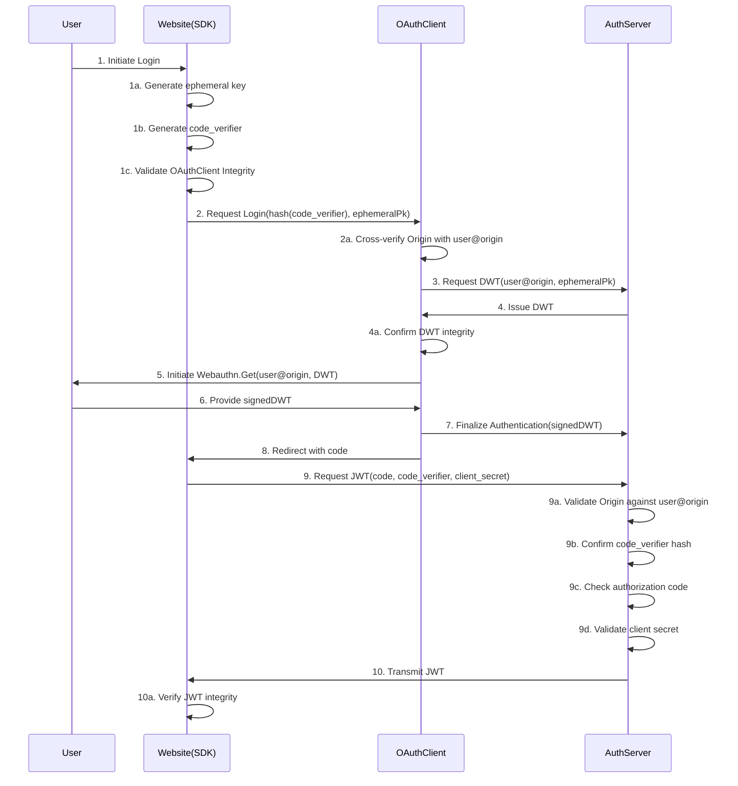

# Architecture

## WebAuthn Flow

OpenID Connect (OIDC) is an authentication protocol that is built upon OAuth 2.0. It enables clients to verify the identity of end users through authentication conducted by an authorization server and obtain basic profile information in an interoperable and REST-like manner. Essentially, OIDC serves as an identity layer atop OAuth 2.0.

When a user wishes to authorize their WebAuthn authenticator, they delegate its authority to an ephemeral key via a DWT (Delegated Web Token) signing process.

A DWT contains the following claims:
- `username` (user)
- `ephemeral public key` (cspk)
- `WebAuthn credential public key` (credpk)
- `expiration` (exp)
- `random nonce` (rand)
- `hash of the above` (hash)

WebAuthn signs the DWT to delegate its authority to the ephemeral key. The additional claims help mitigate replay attacks (via nonce) and ensure time-bound validity. A JWT is also created with these claims and is signed with the private key of the authenticator. The JWT signature is used to adhere to standard Web 2.0 OAuth2 token protocols.

The OAuth2 variant employed here is the Authorization Code Flow enhanced with PKCE (Proof Key for Code Exchange). PKCE protects against interception of the authorization code by a malicious application, preventing it from obtaining a JWT. The Authorization Code Flow ensures that the authorization code is securely transmitted through a back channel, preventing exposure to the end user's browser.

### Flow Diagram

The following is a flow diagram representative of the sequence described above:



Terms:
- **User**: The individual attempting to log in.
- **Website(SDK)**: The platform facilitating user login via the provided SDK.
- **OAuthClient**: The application used for user login.
- **AuthServer**: The server issuing the JWT.
- **ephemeral key**: A temporary key generated to delegate authorization from the WebAuthn authenticator.
- **code_verifier**: A cryptographic element used in PKCE to secure code exchange.
- **code**: An authorization code employed to obtain a JWT.
- **client_secret**: A credential used for client authentication.

#### Verifying OAuthClient Integrity

Google's DNS Resolve API (`dns.google/resolve`) is used to check for a TXT record at `_dnslink.$origin`, containing the OAuthClient code hash. This enforces the **DNSLink** protocol for websites (SDKs) hosted through IPFS. **DNSSEC** helps validate that the DNS records have not been tampered with by providing digital signatures that verify the authenticity of DNS data.

It is crucial to ensure the integrity of the OAuthClient code to prevent malicious actors from persuading users to delegate authority to a compromised ephemeral key. As the OAuthClient and SDK are open source, their integrity can be verified by matching the code hash with that housed on IPFS. Should the SDK deduce any discrepancy in the OAuthClient, it will prohibit further user actions.

#### Verifying DWT Integrity

The integrity check confirms the DWT remains unaltered, particularly ensuring the OAuth server did not modify the ephemeral key.

#### Verifying Origin (9a and 2a)

Origin verification is a safeguard against phishing. It is vital to confirm that the Website(SDK) attempting the login corresponds to the user's actual origin, thus preventing unauthorized acquisition of the user's JWT by another entity. 

#### Verifying Client Secret (9d)

Client secret verification is an additional countermeasure against phishing. By matching the client secret with the domain specified by the clients in their dashboard settings, the system ensures that any unauthorized changes to the domain are detected. However, these origin verifications, coupled with WebAuthn's inherent anti-phishing features, should sufficiently deter related threats.

### TEAL for On-Chain Resource Access Control

The signed DWT—which includes the WebAuthn authenticator's signed hash—acts as a proof of challenge.

On-chain access is restricted via TEAL scripts, which confirm:
- The linkage between credpk and the ephemeral key concerning delegated authority.
- The ephemeral key's signature on the transaction identifier.
- The validity period of the delegation has not expired.

### Enhanced Security Measures

#### CSP

An OAuthClient can outline a Content Security Policy (CSP) to preempt XSS attacks and unauthorized external resource loading.

#### NPM Package Dependency Reduction and Auditing

By minimizing the number of NPM packages and regularly conducting audits, the attack surface is diminished, and the risk of package-based security vulnerabilities is reduced.

#### Ephemeral Key Redundancy & Webcrypto

Dual algorithms, Ed25519 and Secp256r1, are opted for the ephemeral key to not compromise security. Additionally, Secp256r1 keys can be generated as non-exportable using Webcrypto to prevent key extraction.

### Security Postulations

Provided that the hash of the OAuthClient code is trusted, the system achieves a decentralized model where no reliance is placed on the OAuthClient or AuthServer for on-chain user resource access.

### Defences Against Internal Malicious Activities

For the system to be compromised, the following must occur simultaneously:
- Compromise of the SDK's NPM package, specifically the removal of DNSLink validation.
- Modification of OAuthClient hosted content to introduce a rogue version.
  
In such cases, the compromised OAuthClient could integrate a malicious key.

Strategies for enhancing resistance to such attacks include:
- Encouraging developers to verify SDK package integrity and its source code.
- Ensuring the security of DNS access credentials and limiting them to trusted individuals.
- Implementing the following SDK installation method:
```json
"dependencies": {
  "example-package": "https://github.com/username/repo/archive/refs/tags/<tag-name>.tar.gz"
}
```
This ensures the package is based on a signed tag, preventing the unnoticed introduction of malicious versions.

The trust then ultimately lies in the competence of the developers, community scrutiny, and professional audit evaluations.

### Preventing Phishing Attacks

OAuthClient login windows are distinctively styled to alert users to the website they are accessing. This typically displays just the domain name; however, developers can customize this by adding a logo, naming convention, and a color scheme, while ensuring the origin remains visible.

### Options for Account Recovery

#### Recovery Scenarios

The TEAL scripting enables key alterations for recovery scenarios, which may include:
- Full transition to a standard Algorand auth address, such as an ED25519 key.
- Adding a backup key, like an ED25519 key, allowing for normal account use and providing a recovery mechanism accessed through wallets like Pera via WalletConnect.

#### Handling Website Closures

In cases where the associated website or wallet service ceases operations, users could potentially lose access. However, a dedicated `/recover` endpoint is available to assist users in transitioning to a standalone wallet like Pera. Minimal fees incurred through this process are incorporated into the overall service costs paid by the now-defunct website.

The `/recover` route is safeguarded against phishing, as it lacks external communication capabilities which phishing relies on.

#### Advanced Shutdown Notifications

Should the service be obliged to discontinue for any reason, all users will be notified via email a year in advance. This notice period allows ample time for off-ramping to dedicated wallets using the `/recover` feature. Email communication is necessary as it is integral to user login, requiring verification.

Efficient mass email distribution can be achieved through AWS Simple Email Service or a more user-friendly but slightly more expensive alternative like using a React Email template in tandem with services like Resend.

To thwart any malicious exploits involving the `/recover` route directed by an insider, users may be prompted to independently confirm the DNSLink hash. This process could be visible in the network activity log of their browser when resolving DNS.

Alternatively, rather than using the `/recover` endpoint, users could instead be directed to download and run a verified Python script from GitHub. The script would be subject to auditing and distributed as signed releases.

### Disclaimer Statements

- Our service is designed for business-to-business interactions; we are not held liable for the actions taken by the website with the user's key or data. This liability framework is akin to services provided by Magic Link & Web3Auth.
- Users must be made aware of the inherent risks associated with the service—the trust they're placing in the website concerning their key and personal data. Required disclaimers and risk acknowledgments should be communicated to the user directly, possibly through an emailed readme upon sign-up. Following the email link implies consent and understanding of the stipulated terms and conditions.
