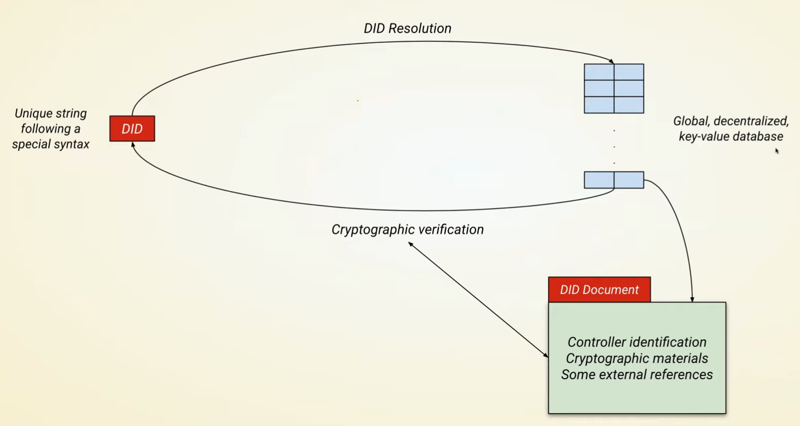

# Decentralized Identity (DID)

## Goals of DID

- Easy to create
- Decentralized, in terms of infrastructure and usage with other providers
- Persistent
- Resolvable to some information about the user
- Cryptographically verifiable, to prove ownership of the DID to the DID Controller


## DID Method



- DID can be resolved in a KV store. Global distributed, persistent storage.
- KV store being the DID document, containing the controller (user or business) identity, cryptographic materials for verification, and other information


## DID KV Store

- Can store it on a distributed ledger, such as Algorand, or IPFS.

This would give it the property of persistence, public availability and global distribution.

## DID Document

- Specifies Controller: User or Business (or some abstract owner), as the owner of the DID
- Cryptographic data
  - Public Keys
  - Expressable with JWK (JSON Web Key, an ISO standard way of storing keys) format or with DID specific terms
  - Used for authentication, DSA and proof of ownership
- Reference to other documents
  - Service endpoints
  - Aggregate other identities
  - Other documents
- DID document isn't necessarily stored in a DB
  - Can be generated on the fly with functions

## Pool of Relationships

- Communicate with other users by their DID
- ECDH (Elliptic Curve Diffie Hellman) to generate a shared secret for encryption

## URI Scheme

- DID is a URI, as with other identifiers like URL, URN, ISBN, etc.

```text
did:method-name:method-specific-identifier
```

DIDs identify an entity through different standard methods.

Examples:
- did:algorand:3E4X5Y6Z7A
- did:btcr:3E4X5Y6Z7A, so the identifier is the transaction ID.
- did:ipfs:3E4X5Y6Z7A, so the identifier is the IPFS hash.

So they're identifiers, that point to a DID document, which contains the cryptographic materials for verification, and other information.

## Typical DID Document Structure

- Serialized as a JSON object

```text
{
    "@context": "https://www.w3.org/ns/did/v1",
    "id": "did:example:123456789abcdefghi",
    "authentication": [{
        "id": "did:example:123456789abcdefghi#keys-1",
        "type": "Ed25519VerificationKey2018",
        "controller": "did:example:123456789abcdefghi",
        "publicKeyBase58": "123456789abcdefghi"
    }],
    "service": [{
        "id": "did:example:123456789abcdefghi#vcs",
        "type": "VerifiableCredentialService",
        "serviceEndpoint": "https://example.com/vc/"
    }],
}
```

- Service is a way to state places where the DID can be used
- Authentication is a way to specify ways of proving ownership of the DID


## IPFS - Ceramic

- Provides DID infrastructure built on top of IPFS
- Versioned file system
- Distributed and persistence
- Can enforce a schema, e.g. DID document
- Scriptable to do things like generate DID documents on the fly

