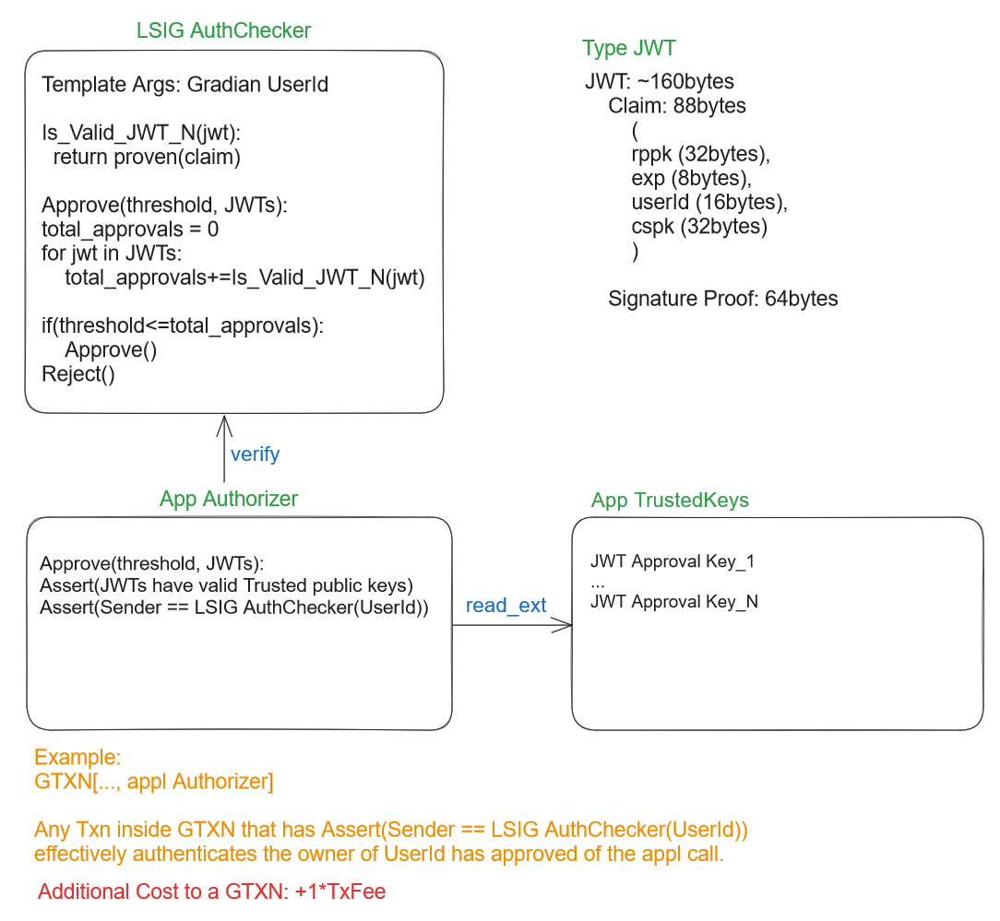

# Accessing your Wallet


## Webauthn PRF Extension
On account creation, a key is generated client side (DEK) and the wallet keys are stored in a JSON blob that's encrypted with the DEK.

Each PRF derived key, per credential, is used to encrypt key. These various DEK encryptions are then stored in the database.

That way, regardless of which credential a user uses to access their account, the DEK can be decrypted and used to decrypt the wallet keys.

```
Payload -> [Encrypt with DEK] -> Encrypted Payload

DEK -> [Encrypt with Public Key 1] -> Encrypted DEK 1
DEK -> [Encrypt with Public Key 2] -> Encrypted DEK 2
...
DEK -> [Encrypt with Public Key N] -> Encrypted DEK N

Bundle: Encrypted Payload, Encrypted DEK 1, Encrypted DEK 2, ... , Encrypted DEK N
```

### Weaknesses

- If the DEK is compromised, all keys are compromised.
- If a credential is compromised, all keys are compromised.
- Difficult to rotate the single encryption key, because a given credential can't access all other DEKs.

#### Addressing Weaknesses

- Store the user encrypted DEK and wallet keys in database after also encrypting with a server HSM key (AWS KMS)
- Give option to rotate DEKs:
  - All credentials are dropped,
  - Account is bound to one credential (current),
  - New DEK is generated and encrypted with PRF from the current credential.
  - Dropping other credentials is necessary because the new DEK can't be encrypted with the other credentials.
- Most users would only use one credential, so this is a good tradeoff.


## Webauthn (without extensions)

### Webauthn Credential-Based Algorand Account Access

The system facilitates Algorand account access delegation through Webauthn credentials. Users authenticate access to Gradian user accounts through Webauthn, where multiple Webauthn credentials can access the same Gradian user account. An LSIG named "LSIG_Cred" will authorize a spending transaction (TX) if:

1. Signed by a keypair unique to a browsing session.
2. This key is sanctioned by the user's Webauthn credential on their device.

The authorization involves:

1. A JWT with session public key (cspk), timestamp (exp), user id (uid), Relying Party (RP) public key (rppk), and nonce (rand).
2. An ED25519 signature ("rpSig") of hash(cspk, exp, uid, rppk, rand) using RP's private key (rpsk).
3. An ED25519 signature ("credSig") of hash(cspk, exp, uid, rppk, rand) using the credential's private key (credsk).
4. An ED25519 signature ("csSig") of hash(TX) signed by the client's session keypair (cspk, cssk).
5. The timestamp (exp) is still valid.

All the above criteria must be satisfied for LSIG approval. Different LSIG_Creds can be mapped to one account but remain unique to a credential. Webauthn's "Create" generates LSIGs while "Get" produces the session keypair. Both the credential and RP sign the JWT hash, confirming transaction access delegation.

**Understanding LSIG:**

LSIG, short for LogicSignature, undergoes validation via a smart contract. Distinct from the traditional public key, LSIG employs intricate conditions for validation. Algorand supports this by enabling programmable transaction conditions.

LSIG consists of:

1. **LogicSignature**: A smart contract detailing the conditions for signature validation. Initialized with PyTeal expressions, it assesses the signature's authenticity.
2. **LogicSignatureTemplate**: An enhanced version of the former, including runtime variables for added versatility.

**Example:**
```python
import pyteal as pt
import beaker

def lsig_validate(user_addr: pt.Expr) -> pt.Expr:
    return pt.Seq(
        (msg := pt.abi.String()).decode(pt.Txn.application_args[2]),
        (sig := pt.abi.make(pt.abi.StaticBytes[64])).decode(pt.Txn.application_args[3]),
        pt.Assert(pt.Ed25519Verify_Bare(msg.get(), sig.get(), user_addr)),
        pt.Int(1),
    )

lsig = beaker.LogicSignatureTemplate(
    lsig_validate,
    runtime_template_variables={"user_addr": pt.TealType.bytes},
)
```
In this example, LSIG checks an ed25519 signature against a provided message.

**Understanding Gradian User Accounts**

A Gradian User Account identifies a User in Gradian's system. A user authenticates themselve with Webauthn. They may
associate multiple Webauthn credentials with their account, so that they can access their account with any of them. A 
feature of Gradian's system is they can create Algorand accounts and delegate access to them through their Webauthn "Get"
credential ceremony. However at any one time, only one Webauthn credential is active.

#### Question

How can we have any Webauthn credential that has been associated with a Gradian account access any Algorand account,
given each LSIG_Cred, associated with one of the credentials, delegates access to a specific Algorand account. Remember
LSIG_Cred are only Logic Signatures that can be used to authorize transactions. They are not Algorand accounts.


### LSIG Container of Assets

So you use an LSIG account that's assigned to a recipient address, so that only they can access the assets contained within. The creator handles loading it with assets and MBR. Once emptied, MBR can be reclaimed.  It doesn't need to be bound to a recipient address, you could also allow any recipient address provided some kind of signed(claim) is given that proves they have authorization.


## Generic DWT Access Delegation 



About 10 JWT auth factors can be used. And there's a trivial extension to allow truly self-custodial customer keys.

- 